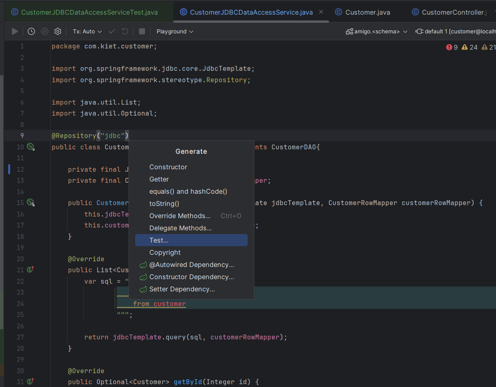

This article will show how to test a *Data Access Object* (DAO) in Spring Boot using **Testcontainers**. Testcontainers is used in tests to create a temporary docker container that contains a real, temporary database instead of mocking it. In this case we will test a DAO that uses **JDBCTemplate**, a **PostgreSQL** database, and **Flyway** for migrations.

## Initial Setup

Create a simple DAO layer with basic CRUD functionalities. In this case we will be using a customer object with id, name, email, age fields. 

```java
package com.kiet.customer;

public class Customer {

    private Integer id;
    private String name;
    private String email;
    private Integer age;

    public Customer() {}

    public Customer(String name, String email, Integer age) {
        this.name = name;
        this.email = email;
        this.age = age;
    }

    public Customer(Integer id, String name, String email, Integer age) {
        this.id = id;
        this.name = name;
        this.email = email;
        this.age = age;
    }

    public Integer getId() {
        return id;
    }

    public void setId(Integer id) {
        this.id = id;
    }

    along with other methods...
}

```

```java
public interface CustomerDAO {
    List<Customer> getAllCustomers();
    Optional<Customer> getById(Integer id);
    void insertCustomer(Customer customer);
    boolean existsPersonWithEmail(String email);
    boolean existsPersonWithId(Integer id);
    void deleteCustomerById(Integer id);
    void updateCustomer(Customer customer);
}
```

```java
package com.kiet.customer;

import org.springframework.jdbc.core.JdbcTemplate;
import org.springframework.stereotype.Repository;

import java.util.List;
import java.util.Optional;

@Repository("jdbc")
public class CustomerJDBCDataAccessService implements CustomerDAO{

    private final JdbcTemplate jdbcTemplate;
    private final CustomerRowMapper customerRowMapper;

    public CustomerJDBCDataAccessService(JdbcTemplate jdbcTemplate, CustomerRowMapper customerRowMapper) {
        this.jdbcTemplate = jdbcTemplate;
        this.customerRowMapper = customerRowMapper;
    }

    @Override
    public List<Customer> getAllCustomers() {
        var sql = """
                    select id, name, email, age
                    from customer
                """;

        return jdbcTemplate.query(sql, customerRowMapper);
    }

    @Override
    public Optional<Customer> getById(Integer id) {
        var sql = """
                    select id, name, email, age
                    from customer
                    where id = ?
                """;

        return jdbcTemplate.query(sql, customerRowMapper, id)
                .stream()
                .findFirst();
    }

    @Override
    public void insertCustomer(Customer customer) {
        var sql = """
                    insert into customer(name, email, age)
                    values(?, ?, ?)
                """;

        int res = jdbcTemplate.update(
                sql,
                customer.getName(),
                customer.getEmail(),
                customer.getAge()
                );
    }

    @Override
    public boolean existsPersonWithEmail(String email) {
        var sql = """
                    SELECT COUNT(*) from customer
                    where email = ?
                """;

        Integer count = jdbcTemplate.queryForObject(sql, Integer.class, email);

        return count > 0 && count != null;
    }

    @Override
    public boolean existsPersonWithId(Integer id) {
        var sql = """
                    select count(*)
                    from customer
                    where id = ?
                """;

        Integer count = jdbcTemplate.queryForObject(sql, Integer.class, id);

        return count > 0 && count != null;
    }

    @Override
    public void deleteCustomerById(Integer id) {
        var sql = """
                    delete from customer
                    where id = ?
                """;

        int res = jdbcTemplate.update(sql, id);
    }

    @Override
    public void updateCustomer(Customer update) {
        if (update.getName() != null) {
            var sql = "UPDATE customer set name = ? where id = ?";
            int res = jdbcTemplate.update(sql, update.getName(), update.getId());
        }

        if (update.getEmail() != null) {
            var sql = "UPDATE customer set email = ? where id = ?";
            int res = jdbcTemplate.update(sql, update.getEmail(), update.getId());
        }

        if (update.getAge() != null) {
            var sql = "UPDATE customer set age = ? where id = ?";
            int res = jdbcTemplate.update(sql, update.getAge(), update.getId());
        }
    }
}
```

Create a database schema in `src/main/resources/db/migration` for Flyway migration. Don't forget to add the Flyway dependency in the pom.xml file.

```sql
create table customer(
    id serial primary key,
    name text not null,
    email text not null unique,
    age int not null
)
```

## Create a Testcontainers abstraction class

We create a new Testcontainers abstraction class in the testing folder (eg: com.projectname). Add a field for the Postgres container with the appropriate Postgres docker image.

```java
@Testcontainers
public abstract class AbstractTestcontainers {

    @Container
    protected static final PostgreSQLContainer<?> postgreSQLContainer =
            new PostgreSQLContainer<>("postgres:latest")
                    .withDatabaseName("dao-unit-test")
                    .withUsername("john")
                    .withPassword("password");
}
```

Add a `beforeAll()` method that uses Flyway migration to setup the DB schema. We get the datasource credentials from the Postgres field before.

```java
@Testcontainers
public abstract class AbstractTestcontainers {

    @BeforeAll
    static void beforeAll() {
        Flyway flyway = Flyway.configure().dataSource(
                postgreSQLContainer.getJdbcUrl(),
                postgreSQLContainer.getUsername(),
                postgreSQLContainer.getPassword()
        ).load();
        flyway.migrate();
        System.out.println();
    }

    @Container
    protected static final PostgreSQLContainer<?> postgreSQLContainer =
            new PostgreSQLContainer<>("postgres:latest")
                    .withDatabaseName("dao-unit-test")
                    .withUsername("john")
                    .withPassword("password");
}
```

Map or register the application's datasource to the Postgres container's credentials using `@DynamicPropertySource`.

```java
    ...
    @DynamicPropertySource // override datasource w/container
    private static void registerDataSourceProperties(DynamicPropertyRegistry registry) {
        registry.add(
                "spring.datasource.url",
                postgreSQLContainer::getJdbcUrl
        );
        registry.add(
                "spring.datasource.username",
                postgreSQLContainer::getUsername
        );
        registry.add(
                "spring.datasource.password",
                postgreSQLContainer::getPassword
        );
    }
    ...
```

Add a `getDataSource()` method to get the datasource and inject it to create a JdbcTemplate variable, which will be used in the tests.

```java
    private static DataSource getDataSource() {
        DataSourceBuilder<?> builder = DataSourceBuilder.create()
                .driverClassName(postgreSQLContainer.getDriverClassName())
                .url(postgreSQLContainer.getJdbcUrl())
                .username(postgreSQLContainer.getUsername())
                .password(postgreSQLContainer.getPassword());
        return builder.build();
    }

    protected static JdbcTemplate getJdbcTemplate() {
        return new JdbcTemplate(getDataSource());
    }
```

## Create DAO unit tests

Create a `CustomerJDBCDataAccessServiceTest` class by generating it from the `CustomerJDBCDataAccessService` class file (right click anywhere in the file > generate > test). 



Make sure the class **extends** the Testcontainers abstraction class.

```java
package com.kiet.customer;

import com.kiet.AbstractTestcontainers;

class CustomerJDBCDataAccessServiceTest extends AbstractTestcontainers {

}
```

Add a `CustomerJDBCDataAccessService` field that will be tested and inject the JdbcTemplate using `getJdbcTemplate()`. Using `@BeforeEach` will make a new instance for each test. A row mapper is also added in this case, but not needed if JPA is used instead of JDBCTemplate.

```java
class CustomerJDBCDataAccessServiceTest extends AbstractTestcontainers {

    private CustomerJDBCDataAccessService underTest;
    private final CustomerRowMapper customerRowMapper = new CustomerRowMapper();

    @BeforeEach
    void setUp() {
        underTest = new CustomerJDBCDataAccessService(
                getJdbcTemplate(),
                customerRowMapper
        );
    }
}
```

Freely add tests using the CustomerJDBCDataAccessService field. This example uses JUnit.

```java
class CustomerJDBCDataAccessServiceTest extends AbstractTestcontainers {

    private CustomerJDBCDataAccessService underTest;
    private final CustomerRowMapper customerRowMapper = new CustomerRowMapper();

    @BeforeEach
    void setUp() {
        underTest = new CustomerJDBCDataAccessService(
                getJdbcTemplate(),
                customerRowMapper
        );
    }

    @Test
    void getAllCustomers() {
        // GIVEN
        Customer customer = new Customer(
                faker.name().fullName(),
                faker.internet().safeEmailAddress() + "-" + UUID.randomUUID(),
                20
        );

        underTest.insertCustomer(customer);

        // WHEN
        List<Customer> actual = underTest.getAllCustomers();

        // THEN
        assertThat(actual).isNotEmpty();
    }

    @Test
    void getById() {
        // GIVEN
        String email = faker.internet().safeEmailAddress() + "-" + UUID.randomUUID();
        Customer customer = new Customer(
                faker.name().fullName(),
                email,
                20
        );

        underTest.insertCustomer(customer);

        Integer id = underTest.getAllCustomers()
                .stream()
                .filter(c -> c.getEmail().equals(email))
                .map(Customer::getId)
                .findFirst()
                .orElseThrow();

        // WHEN
        Optional<Customer> actual = underTest.getById(id);
        System.out.println(actual);

        // THEN
        assertThat(actual).isPresent().hasValueSatisfying(c -> {
            assertThat(c.getId()).isEqualTo(id);
            assertThat(c.getName()).isEqualTo(customer.getName());
            assertThat(c.getAge()).isEqualTo(customer.getAge());
        });
    }

    @Test
    void willReturnEmptyGetById() {
        // GIVEN
        int id = -1;

        // WHEN
        var actual = underTest.getById(id);

        // THEN
        assertThat(actual).isEmpty();
    }

    @Test
    void insertCustomer() {
        // GIVEN
        String email = faker.internet().safeEmailAddress() + "-" + UUID.randomUUID();
        Customer customer = new Customer(
                faker.name().fullName(),
                email,
                20
        );

        // WHEN
        underTest.insertCustomer(customer);

        Optional<Customer> actual = underTest.getAllCustomers()
                .stream()
                .filter(c -> c.getEmail().equals(email))
                .findFirst();

        // THEN
        assertThat(actual).isPresent().hasValueSatisfying(c -> {
            assertThat(c.getName()).isEqualTo(customer.getName());
            assertThat(c.getName()).isEqualTo(customer.getName());
        });
    }

    @Test
    void existsPersonWithEmail() {
        // GIVEN
        String email = faker.internet().safeEmailAddress() + "-" + UUID.randomUUID();
        Customer customer = new Customer(
                faker.name().fullName(),
                email,
                20
        );

        underTest.insertCustomer(customer);

        // WHEN
        boolean actual = underTest.existsPersonWithEmail(email);

        // THEN
        assertThat(actual).isTrue();
    }

    @Test
    void existsPersonWithId() {
        // GIVEN
        String email = faker.internet().safeEmailAddress() + "-" + UUID.randomUUID();
        Customer customer = new Customer(
                faker.name().fullName(),
                email,
                20
        );

        underTest.insertCustomer(customer);
        Integer id = underTest.getAllCustomers()
                .stream()
                .filter(c -> c.getEmail().equals(email))
                .map(Customer::getId)
                .findFirst()
                .orElseThrow();

        // WHEN
        boolean actual = underTest.existsPersonWithId(id);

        // THEN
        assertThat(actual).isTrue();
    }

    @Test
    void deleteCustomerById() {
        // GIVEN
        String email = faker.internet().safeEmailAddress() + "-" + UUID.randomUUID();
        Customer customer = new Customer(
                faker.name().fullName(),
                email,
                20
        );

        underTest.insertCustomer(customer);
        Integer id = underTest.getAllCustomers()
                .stream()
                .filter(c -> c.getEmail().equals(email))
                .map(Customer::getId)
                .findFirst()
                .orElseThrow();
        // WHEN
        underTest.deleteCustomerById(id);
        boolean actual = underTest.existsPersonWithId(id);

        // THEN
        assertThat(actual).isFalse();
    }

    @Test
    void updateCustomer() {
        // GIVEN
        String email = faker.internet().safeEmailAddress() + "-" + UUID.randomUUID();
        Customer customer = new Customer(
                faker.name().fullName(),
                email,
                20
        );
        underTest.insertCustomer(customer);
        Integer id = underTest.getAllCustomers()
                .stream()
                .filter(c -> c.getEmail().equals(email))
                .map(Customer::getId)
                .findFirst()
                .orElseThrow();

        // WHEN
        Customer customer1 = new Customer(
                id,
                faker.name().fullName(),
                faker.internet().safeEmailAddress() + "-" + UUID.randomUUID(),
                22
        );
        underTest.updateCustomer(customer1);
        Optional<Customer> actual = underTest.getById(id);

        // THEN
        assertThat(actual).isPresent().hasValue(customer1);
    }
}
```

Thanks for reading!