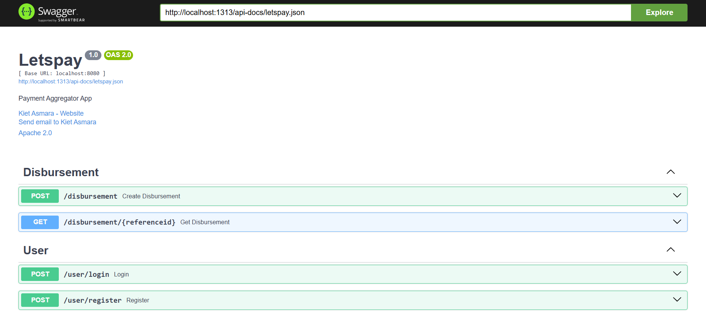
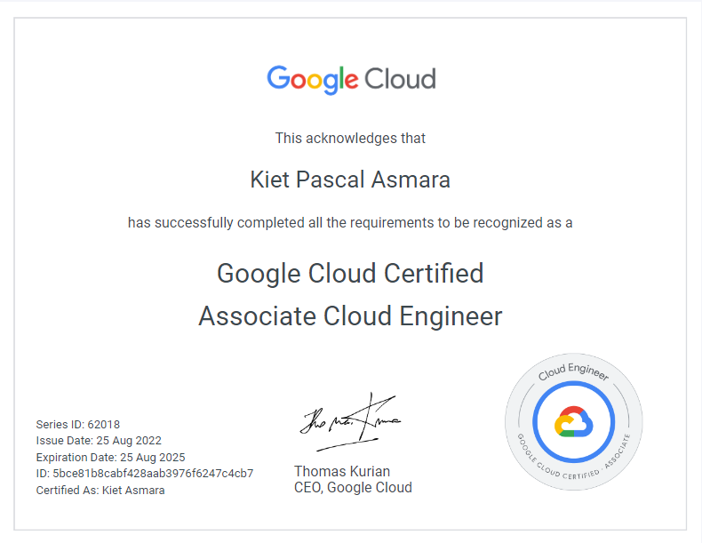
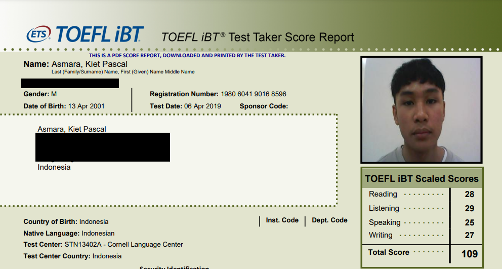

This section contains some of my projects and certificates. Other exercises/projects are located in my [github](https://github.com/kietpa).

## 🏧 Letspay (WIP)

**Letspay** is a payment aggregator app that will be integrated with multiple providers such as Xendit & Midtrans. It is made for the purpose of learning technologies such as Grafana logging, Integration with payment providers, microservices, etc. Currently still in progress.

<a href="https://github.com/kietpa/letspay">Repo</a>  |  <a href="/projects/letspay">API Documentation</a>

## 🥝 Kiwish

**Kiwish** is an e-commerce application with many features, made using *microservices* and gRPC. Notable features include payment gateway, shipment tracking, and e-mail notifications. The service was deployed on *Google Cloud Run*, while the databases were deployed on *Railway*. The project was made together with two of my friends.

<a href="https://github.com/arvisy/kiwish">Repo</a>  |  <a href="/projects/kiwish">API Documentation</a>

## 🔎 True Sight

Tech Stack:

- Google Cloud
- Flask
- Kotlin
- Tensorflow

**True Sight** is a news credibility checker platform that uses Natural Language Processing (NLP) to validate news submitted by users. App was available on Android using an API deployed on Google Cloud Run. I was in charge of designing the **Google Cloud** infrastructure. Created as the final project of the [Bangkit Academy 2022](https://grow.google/intl/id_id/bangkit/) program with five other teammates.

<a href="https://github.com/C22-PS119">Repo</a>  |  <a href="https://docs.google.com/presentation/d/12gIpZy8aiA4JOet8BcEIkIr1qZlrXzb9jPUsR4dmwmM/edit?usp=sharing">Slideshow</a>

## 👔 Clothera

**Clothera** is a simple CLI app for a Clothing store. Made purely with **Golang** and MySQL. Created with two of my friends.

<a href="https://github.com/kietpa/clothera">Repo</a>  |  <a href="https://docs.google.com/presentation/d/1ZMuYfju0HzGqvV9Rl5bnrk5mpsCpM33q8dw0j0w-vn4/edit?usp=sharing">Slideshow</a>

## 🏬 Hotel 626

**A hotel API** mini-project made in around 3 days. Created with Golang, PostgreSQL, GORM, and Echo. Includes a **Xendit** payment gateway and email notifications.

<a class="text-l" href="https://github.com/kietpa/hotel-626">Repo</a>

## ⚙️ DC Motor Speed Control with EKF & PI-PSO

A program to estimate and control the speed of a non-linear *DC Motor* without using speed sensors, only electrical sensors. The estimation was done using the ***Extended Kalman Filter*** (EKF) while the motor was controlled by a PI controller, tuned using the ***Particle Swarm Optimization*** (PSO) algorithm. The program was made using MATLAB scripts and Simulink. Created as my **final project** in university.

<a href="https://github.com/kietpa/DCMotor_EKF_PI-PSO">Repo</a>  |  <a href="https://docs.google.com/presentation/d/1iS_gpW14bp4P91pkkgexp0vfNEUtq4ft/edit?usp=sharing&ouid=117927957500009183925&rtpof=true&sd=true">Slideshow</a>  |  <a href="https://drive.google.com/file/d/1eVb1LQNka8v2IrZaz02AhzmxgsRHcZHe/view?usp=sharing">Article</a>

## 📜 Certificates

### ☁️ Google Cloud Associate Cloud Engineer

An **Associate Cloud Engineer** deploys applications, monitors operations, and manages enterprise solutions. This individual is able to use *Google Cloud Console* and the command-line interface to perform common platform-based tasks to maintain one or more deployed solutions that leverage Google-managed or self-managed services on Google Cloud.

Link: [5bce81b8cabf428aab3976f6247c4cb7](https://www.credential.net/9d5786b6-18d4-45d9-973b-45bbd211d64a?key=dbea6aa3dafaaad8d4b8d45128c38a99ea79f855b149e9e930a2ebbe8eb189be)

### 📚 TOEFL iBT

The **TOEFL iBT®** test measures the ability to use and understand academic English. This certification is an asset for international mobility in over 160 countries. This test is a world reference. More than 35 million people worldwide have attested to their English language proficiency by taking the TOEFL iBT test. The test assesses written and oral comprehension and expression skills in an academic context from intermediate to advanced levels.

Full certificate provided by request.