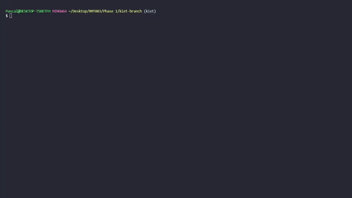
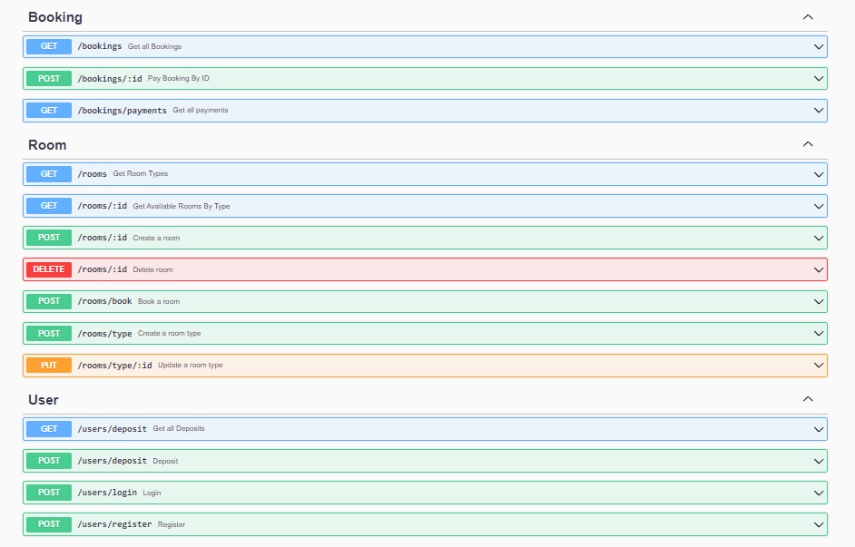

This section contains some of my projects and certificates.

## 🔎 True Sight

Tech Stack:

- Google Cloud
- Flask
- Kotlin
- Tensorflow

**True Sight** is a news credibility checker platform that uses Natural Language Processing (NLP) to validate news submitted by users. App was available on Android using an API deployed on Google Cloud Run. I was in charge of designing the **Google Cloud** infrastructure. Created as the final project of the [Bangkit Academy 2022](https://grow.google/intl/id_id/bangkit/) program with five other teammates.

<a href="https://github.com/C22-PS119">Repo</a>  |  <a href="https://docs.google.com/presentation/d/12gIpZy8aiA4JOet8BcEIkIr1qZlrXzb9jPUsR4dmwmM/edit?usp=sharing">Slideshow</a>

## 👔 Clothera

**Clothera** is a simple CLI app for a Clothing store. Made purely with **Golang** and MySQL. Created for the [Hacktiv8 bootcamp](https://hacktiv8.com/bootcamp-golang) program with two of my friends.

<a href="https://github.com/kiet-asmara/clothera">Repo</a>  |  <a href="https://docs.google.com/presentation/d/1ZMuYfju0HzGqvV9Rl5bnrk5mpsCpM33q8dw0j0w-vn4/edit?usp=sharing">Slideshow</a>

## 🏬 Hotel 626

**A hotel API** mini-project made in around 24 hours. Created with Golang, PostgreSQL, GORM, and Echo. Includes a **Xendit** payment gateway and email notifications.

<a class="text-l" href="https://github.com/kiet-asmara/hotel-626">Repo</a>

## ⚙️ DC Motor Speed Control with EKF & PI-PSO

A program to estimate and control the speed of a non-linear *DC Motor* without using speed sensors, only electrical sensors. The estimation was done using the ***Extended Kalman Filter*** (EKF) while the motor was controlled by a PI controller, tuned using the ***Particle Swarm Optimization*** (PSO) algorithm. The program was made using MATLAB scripts and Simulink. Created as my **final project** in university.

<a href="hhttps://github.com/kiet-asmara/DCMotor_EKF_PI-PSO">Repo</a>  |  <a href="https://docs.google.com/presentation/d/1iS_gpW14bp4P91pkkgexp0vfNEUtq4ft/edit?usp=sharing&ouid=117927957500009183925&rtpof=true&sd=true">Slideshow</a>  |  <a href="https://drive.google.com/file/d/1eVb1LQNka8v2IrZaz02AhzmxgsRHcZHe/view?usp=sharing">Article</a>

##